

  

<h1 align="center" style="color:#2E86C1;">AWS EC2 - Linux Server Creation Guide</h1>
 

<h3 align="left" style="color:#2E86C1;">📝 Introduction</h3>

---

This guide walks you through creating a **Linux server** on AWS EC2 using the AWS Management Console. Steps include launching the server, configuring networking, and ensuring secure access.

 

<h3 align="left" style="color:#2E86C1;">🧭 Step-by-Step Instructions</h3>

---

### 📌 Step 1: Search EC2 and Click "Launch Instance"
- Go to the AWS Console
- Search for **EC2**
- Click on **"Launch Instance"**

  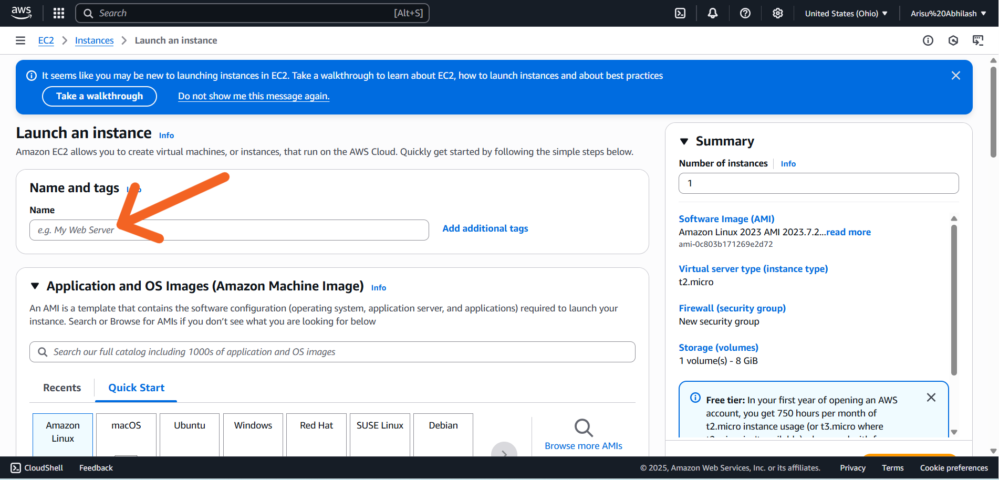
   
  <i>Figure 1: Launch EC2 from AWS Console</i>

---

### 📌 Step 2: Provide a Name for Your Server
- Example name: `linux-test-server`

  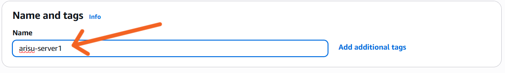
   
  <i>Figure 2: Naming the EC2 instance</i>

---

### 📌 Step 3: Choose the Operating System
- Choose from:
  - ✅ Amazon Linux
  - ✅ Ubuntu
  - ✅ (Optional: Windows or Android)

  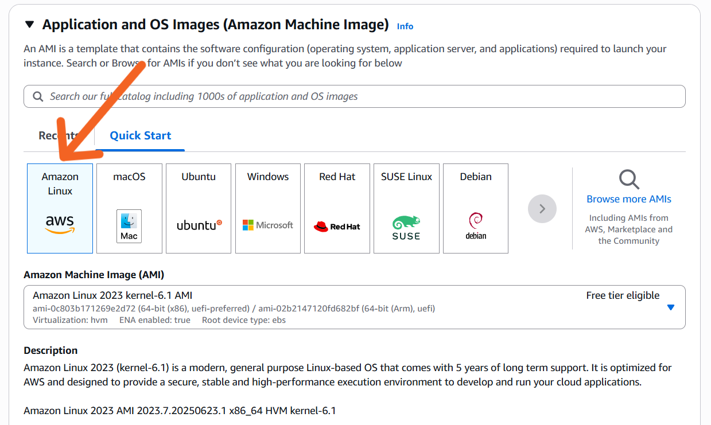
   
  <i>Figure 3: Selecting an OS (e.g. Linux)</i>

---

### 📌 Step 4: Select Instance Type
- Use **t2.micro** (Free Tier eligible)
- Consider your app’s CPU, memory, and network needs

  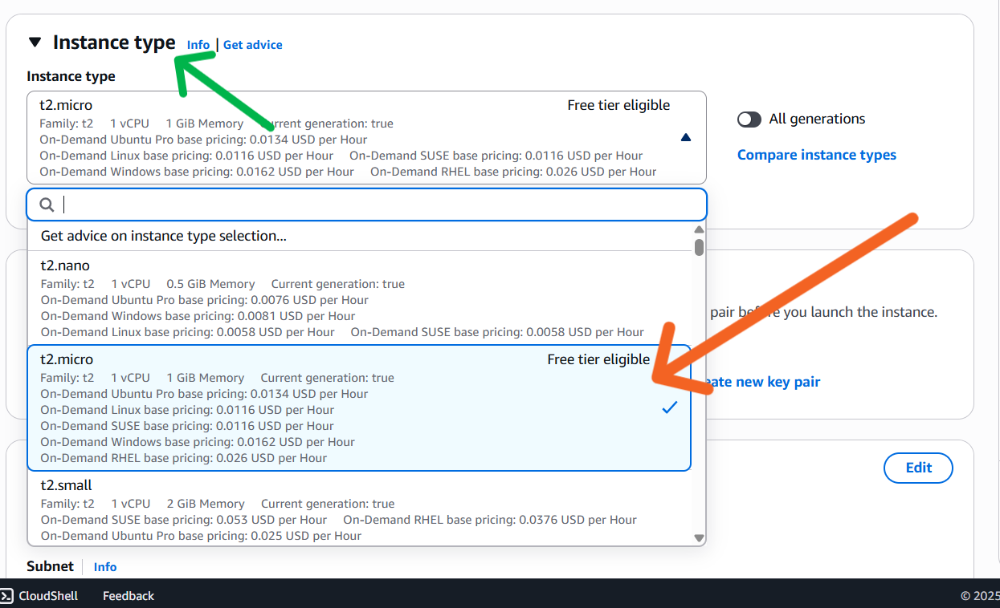
   
  <i>Figure 4: Selecting the instance type</i>

---

### 📌 Step 5: Configure Key Pair Login
- Select or create a **key pair**
- Download the `.pem` file for secure SSH access

  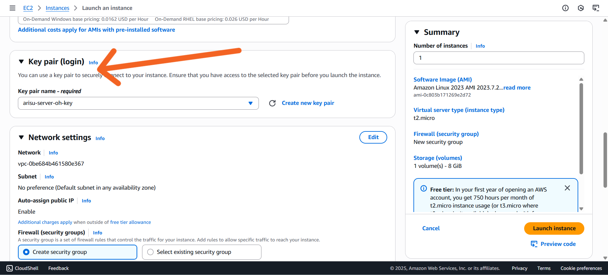
   
  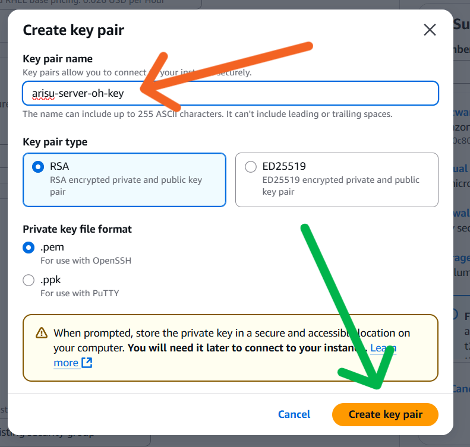
   
  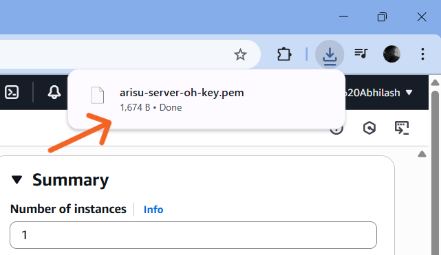
   
  <i>Figure 5: Key pair setup for EC2 login</i>

---

### 📌 Step 6: Configure Network Settings
- Allow:
  - ✅ SSH (Port 22)
  - ✅ HTTP (Port 80)
  - ✅ HTTPS (Port 443)

  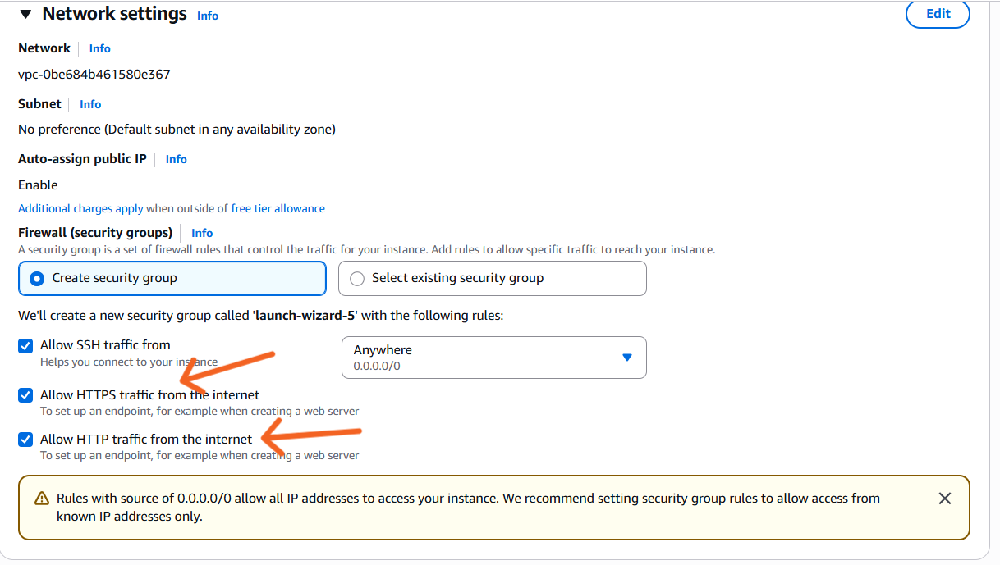
   
  <i>Figure 6: Opening ports in the security group</i>

---

### 📌 Step 7: Launch the Instance
- Click **“Launch Instance”**
- Wait until the status is **"running"**

  
   
  <i>Figure 7: Launching the EC2 instance</i>

---

## ✅ Final Result

  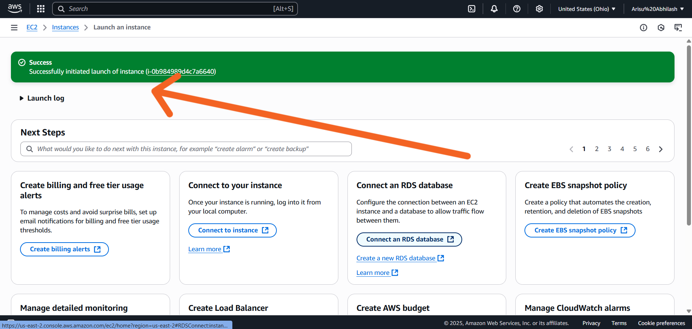
   
  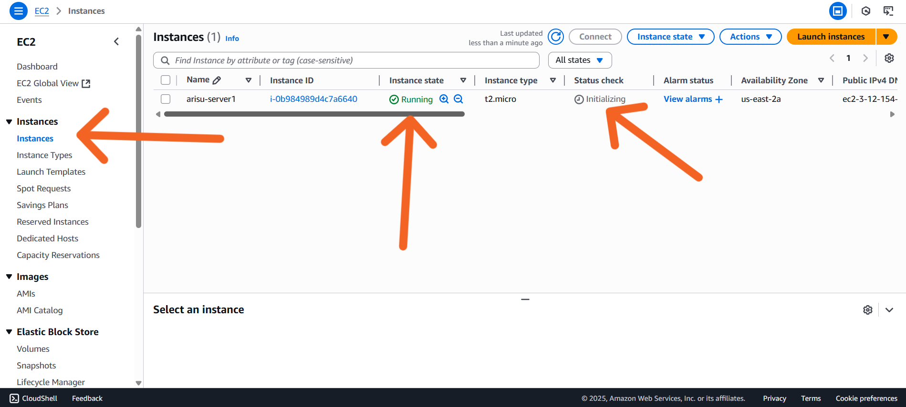
   
  <i>Figure 8: EC2 instance successfully launched</i>

---

## 📽️ Step 8+: Connecting to server (Continue With Video Reference)

> The remaining steps (e.g., connecting via SSH, installing Apache, running your app) will be demonstrated via video.

  <a href="https://drive.google.com/file/d/1zX5c7S7lMIs2XDo-JDVYdPwKoXlMahGS/view?usp=drive_link">
    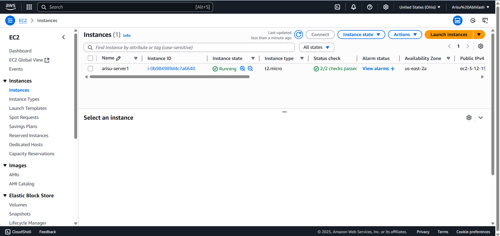
  </a>

## 📚 Learnings

- Step-by-step EC2 setup
- Key pair login and instance type configuration
- Opened networking ports for real-world hosting

---

## 🔗 Resources

- [AWS EC2 Documentation](https://docs.aws.amazon.com/ec2/)
- [AWS Free Tier](https://aws.amazon.com/free)
