

  

  

<h1 align="center" style="color:#2E86C1;">AWS EC2 - Windows Server Creation Guide</h1>
 

<h3 align="left" style="color:#2E86C1;">📝 Introduction</h3>

---

This guide walks you through creating a **Windows Server** on AWS EC2 using the AWS Management Console. Steps include launching the server, configuring networking, connecting via RDP, and setting up IIS for hosting a webpage.

 

<h3 align="left" style="color:#2E86C1;">🧭 Step-by-Step Instructions</h3>

---

### 📌 Step 1: Search EC2 and Click "Launch Instance"
- Go to the AWS Console
- Search for **EC2**
- Click on **"Launch Instance"**

  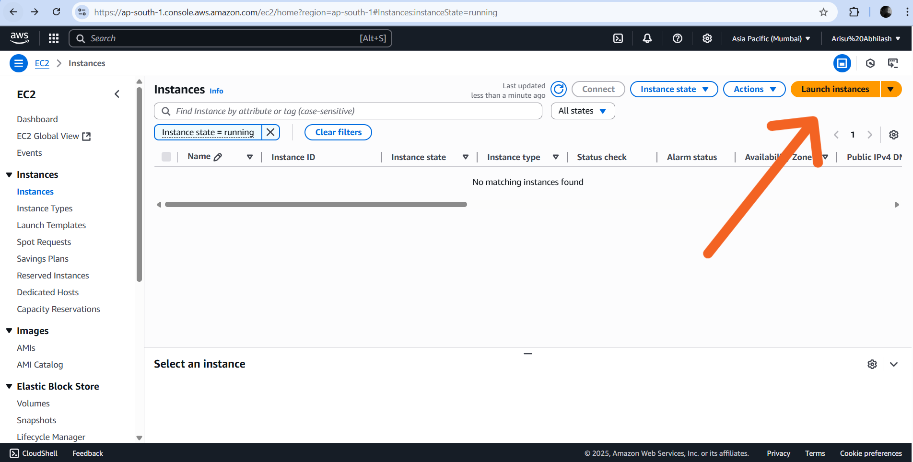
   
  <i>Figure 1: Launch EC2 from AWS Console</i>

---

### 📌 Step 2: Provide a Name for Your Server
- Example name: `windows-demo-server`

  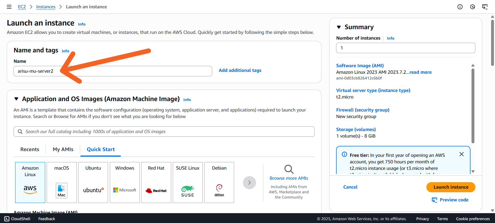
   
  <i>Figure 2: Naming the EC2 instance</i>

---

### 📌 Step 3: Choose the Operating System
- Select **Microsoft Windows Server 2019 Base** or later

  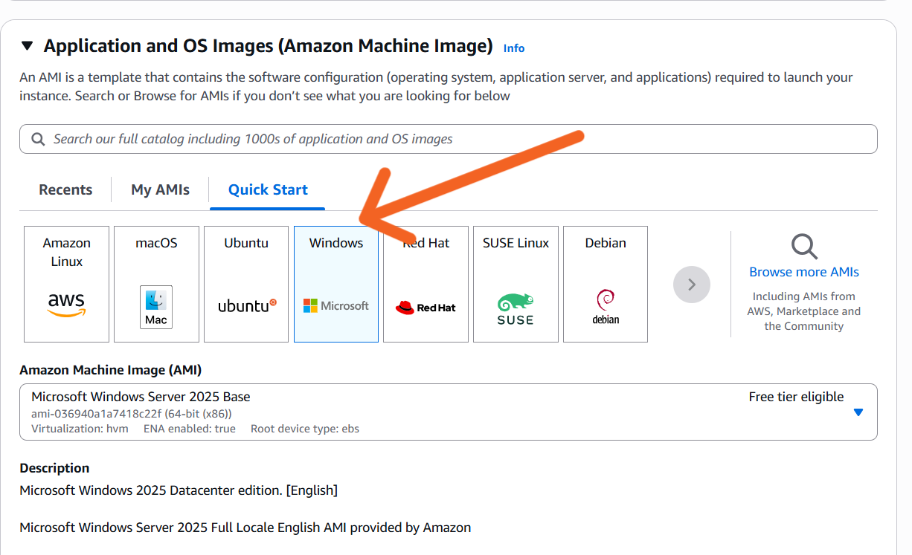
   
  <i>Figure 3: Selecting the Windows OS</i>

---

### 📌 Step 4: Select Instance Type
- Use **t2.micro** (Free Tier eligible)
- Suitable for basic testing and small workloads

  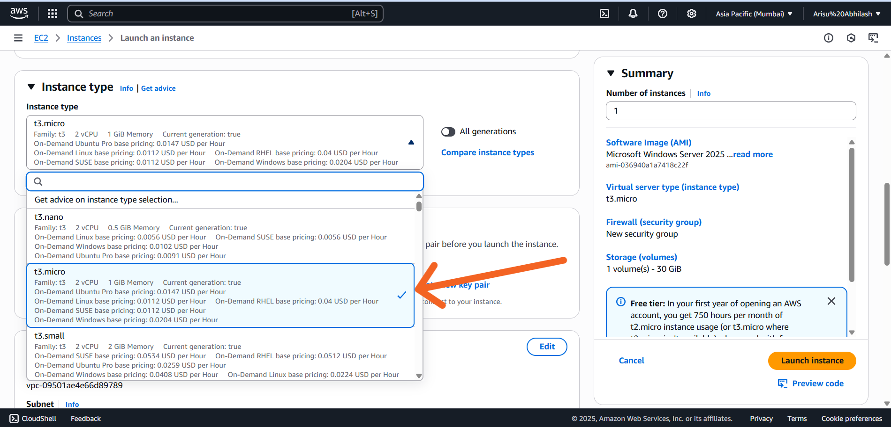
   
  <i>Figure 4: Selecting the instance type</i>

---

### 📌 Step 5: Configure Key Pair Login
- Select or create a **key pair**
- Download the `.pem` file — required to decrypt your Windows admin password

  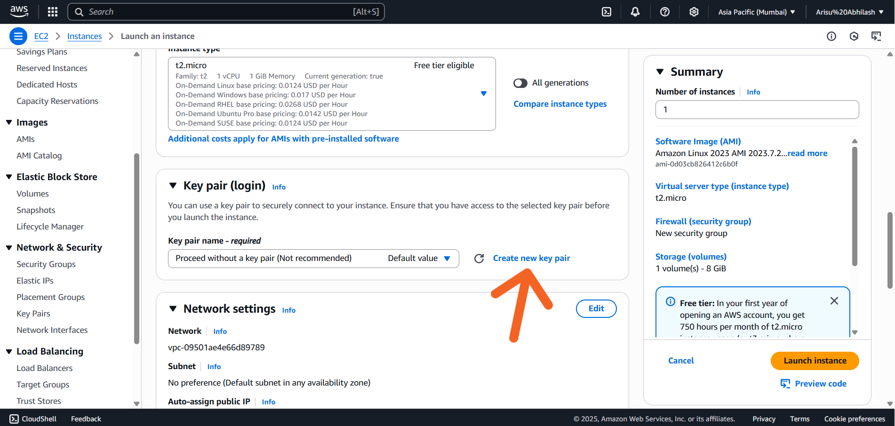
   
  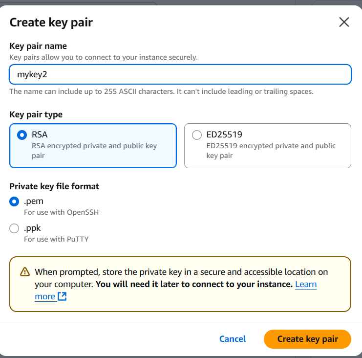
   
  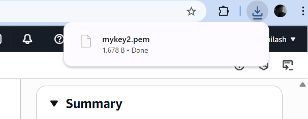
   
  <i>Figure 5: Key pair configuration for secure access</i>

---

### 📌 Step 6: Configure Network Settings
- Allow:
  - ✅ RDP (Port 3389) for remote desktop connection
  - ✅ HTTP (Port 80)
  - ✅ HTTPS (Port 443)

  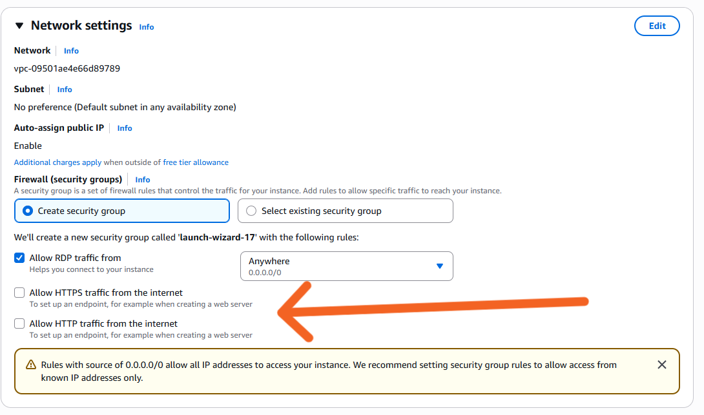
   
  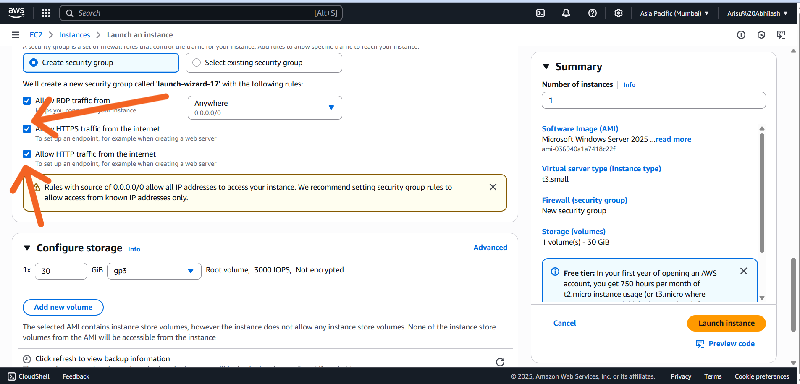
   
  <i>Figure 6: Configuring the security group for RDP & web access</i>

---

### 📌 Step 7: Launch the Instance
- Click **“Launch Instance”**
- Wait for instance status to become **"running"**

  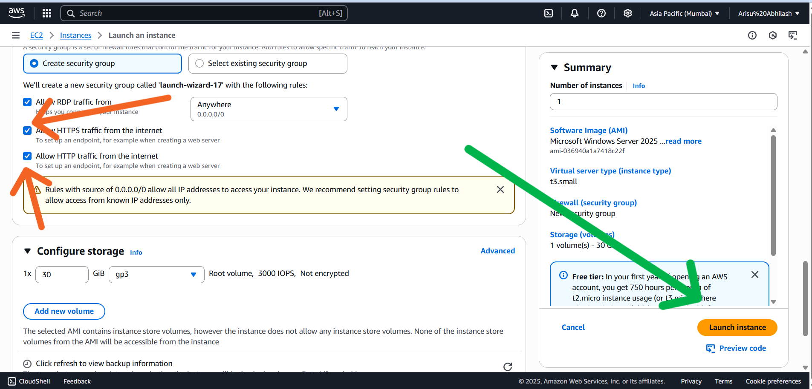
   
  <i>Figure 7: Launching the EC2 Windows instance</i>

---

## ✅ Final Result

  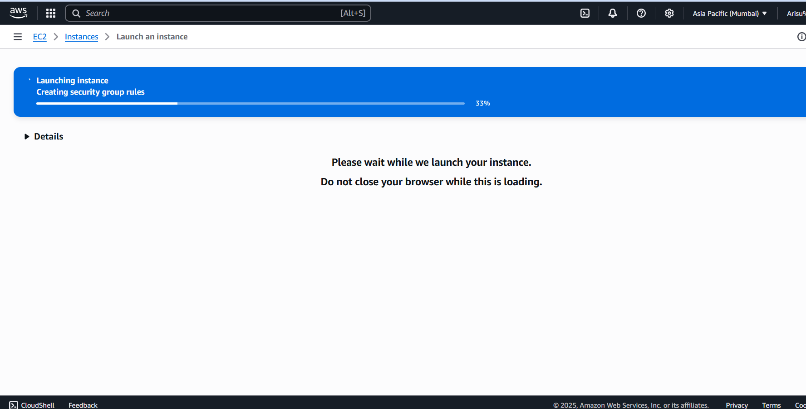
   
  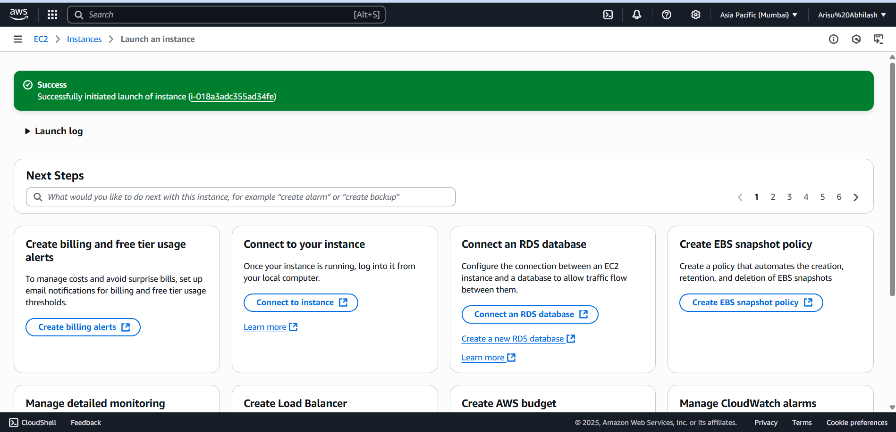
   
  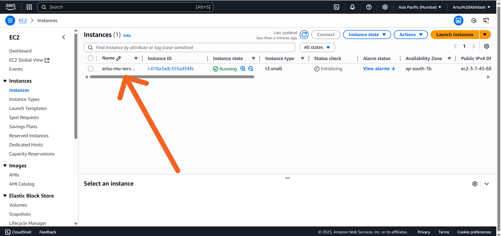
   
  <i>Figure 8: Windows EC2 instance running successfully</i>

---

## 📽️ Step 8+: Connecting via RDP & IIS Web Hosting

> The remaining steps (connecting via Remote Desktop, installing IIS, adding `index.html`, and viewing it via browser) are shown in the following video.

  <a href="https://drive.google.com/file/d/1CHRKFXtuh7ni3c7kbFweRA_1bTcn-6OK/view?usp=drive_link">
  
  <i> click on Picture to play video
  </a>

---

## 📚 Learnings

- Step-by-step EC2 setup using Windows OS
- Key pair login and RDP password decryption
- Enabling RDP, HTTP, and HTTPS access
- Hosting a webpage with IIS on a Windows EC2 instance

---

## 🔗 Resources

- [AWS EC2 Windows Documentation](https://docs.aws.amazon.com/AWSEC2/latest/WindowsGuide/)
- [AWS Free Tier](https://aws.amazon.com/free)
