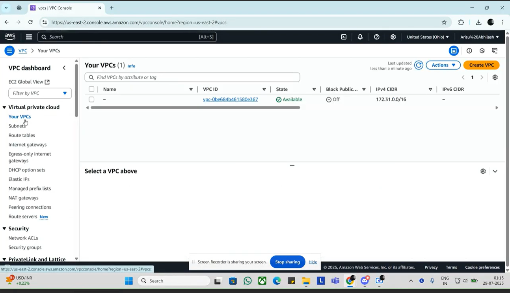

<p align="center">
  
</p>

<h1 align="center" style="color:#2E86C1;">AWS VPC    (Virtual Private Cloud)</h1>
</br>

<h3 align="left" style="color:#2E86C1;">📝 Introduction</h3>

---
This is my step-by-step guide for setting up a custom VPC, creating subnets, launching EC2 instances, and testing internet and server-to-server connectivity using AWS Console.

---

## 🚀 Steps

### 🔹 Step 1: Create VPC

- Go to AWS Dashboard  
- Search for `VPC` and open it  
- Click on **Create VPC**  
- Select **VPC only**  
- Give it name: `myvpc1`  
- IPv4 CIDR block: **manual input**  
- IPv4 CIDR IP: `192.168.0.0/16`  
- Click **Create VPC**

---

### 🔹 Step 2: Create Subnet

- Go to **Subnets** → Click **Create subnet**  
- Select the VPC you created (`myvpc1`)  
- Name it: `subnet1`  
- Availability Zone: random  
- IPv4 CIDR block: `192.168.0.0/24`  
- Click **Create subnet**

---

### 🔹 Step 3: Launch EC2 Instance (Linux)

- Go to **EC2** → Click **Launch Instance**  
- Select **Linux** as the OS  
- Go to **Network Settings** → Edit settings  
  - Select your VPC: `myvpc1`  
  - Select Subnet: `subnet1`  
  - Enable **Auto-assign Public IP**  
  - Create your own **Security Group**
    - Type: **All Traffic**
    - Source: **Anywhere**
- Launch the server

---

### 🔹 Step 4: Set up Internet Gateway & Route Table

- Go to **VPC tab**  
- Create **Internet Gateway** (name it `ig1`)  
- Attach it to VPC: `myvpc1`

- Go to **Route Table** → Create Route Table  
- Select `myvpc1`  
- Then go to the created route table (`route1`)  
  - Go to **Subnet Association**  
  - Click **Edit Subnet Association**  
  - Select `subnet1` and **save**

- Now go to **Routes** → Click **Edit Routes**  
  - Add route: `0.0.0.0/0`  
  - Select target: `ig1` (Internet Gateway we created)

---

### 🔹 Step 5: Connect and Ping Google

- Connect to the server you created  
- Run the following commands:
  ```bash
  sudo su
  ping 0.0.0.0
  ```
- If it's running, you are connected to Google  
- Press `Ctrl + Z` to exit

---

### 🔹 Step 6: Create Subnet 2

- Go to **Subnets** → Click **Create Subnet**  
- Select VPC: `myvpc1`  
- Name: `subnet2`  
- Availability Zone: random  
- IPv4 CIDR: `192.168.16.0/24`  
- Click **Create subnet**

- Go to **Route Table** → Select `route1`  
- Go to **Subnet Associations** → Edit → Add `subnet2`

---

### 🔹 Step 7: Launch Server 2 (Linux)

- Go to EC2 → Launch Instance  
- OS: Linux  
- VPC: `myvpc1`  
- Subnet: `subnet2`  
- Enable Auto-assign Public IP  
- Use same Security Group (All Traffic, Anywhere)  
- Launch the instance

---

### 🔹 Step 8: Test Server-to-Server Connectivity

- Copy **Public IP** of **Server 2**  
- Go to **Server 1** (created in Subnet 1)  
- Run:
  ```bash
  ping <Public IP of Server 2>
  ```
- If ping works, then **both servers are connected**

---

<p align="center">
  <a href="https://drive.google.com/file/d/1Yl2pEr8uMblTrIhO6m7aEv73rMN1NZhG/view?usp=drive_link">
    
    </br> Click To Watch Video
  </a>
</p>
---

## 📌 IP Details Used

| Name      | CIDR              |
|-----------|-------------------|
| VPC       | 192.168.0.0/16    |
| Subnet 1  | 192.168.0.0/24    |
| Subnet 2  | 192.168.16.0/24   |

---

## ✅ Final Outcome

- Both EC2 instances can connect to the internet ✅  
- Both EC2 instances can ping each other ✅  
- VPC, subnets, route table, and IGW were configured manually

---

## 🧠 Summary

This is my practical hands-on learning of AWS networking:
- Created custom VPC
- Made subnets with CIDR blocks
- Set up Internet Gateway and routing
- Deployed and connected two EC2 instances
