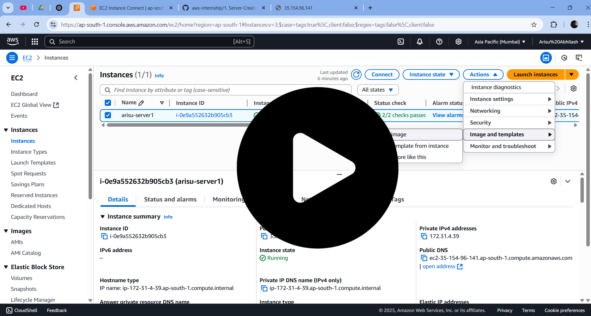

  

<h1 align="center" style="color:#2E86C1;">AWS EC2 – AMI Creation & Launch Guide (Linux)</h1>
 

<h3 align="left" style="color:#2E86C1;">📝 Introduction</h3>

---

This guide explains how to create an **Amazon Machine Image (AMI)** from an existing Linux EC2 instance and how to launch a new server from that AMI.

In this process, you’ll learn how to:

- Save your EC2 instance as a reusable image
- Quickly deploy identical instances from your AMI
- Clean up unused resources to avoid charges

 

<h3 align="left" style="color:#2E86C1;">⚙️ Prerequisites</h3>

---

Before you begin:

- **Launch a Linux or Windows EC2 Instance**  
   - Choose either **Linux** or **Windows** server as per your requirement.
   - **Host any basic application or webpage** (for example: a simple `index.html`).
   - **If you don’t know how to create and host**, refer to my detailed server creation guides:

   - 👉 [Linux EC2 Server Setup Guide](https://github.com/ArisuAbhilash/aws-internship/blob/main/1.%20Server-Creation/aws-linux(EC2)/aws-linux-ec2.md)  
   - 👉 [Windows EC2 Server Setup Guide](https://github.com/ArisuAbhilash/aws-internship/blob/main/1.%20Server-Creation/aws-windows(EC2)/aws-windows-ec2.md)

---

<h3 align="left" style="color:#2E86C1;">📽️ Full Video Demonstration</h3>

---

> Watch the **complete hands-on video** for AMI creation and launching an EC2 instance from your AMI.

  

---

## 🧭 Steps Covered in the Video

1. **Select the EC2 Instance**  
   Go to **Actions → Image and Templates → Create Image**

2. **Wait for AMI Creation**  
   It takes **5–10 minutes**.

3. **Launch New Instance from AMI**  
   Go to **AMIs section**, select the created AMI, and click  
   **"Launch Instance from Image"**

---

## 🗑️ Cleanup: Terminate Servers & Deregister AMI

After your practice or project is done, remember to:

### ✅ Terminate EC2 Instances

- Go to **EC2 Dashboard → Instances**
- Select the instances you no longer need
- Click **Actions → Instance State → Terminate**

### ✅ Deregister AMI and Delete Snapshots

- Go to **EC2 Dashboard → AMIs**
- Select the AMI you created and click **Deregister**

- Then go to **Snapshots** and delete the snapshot associated with the AMI to free up storage.

> ⚠️ **Warning:** If you don’t do this, AWS may charge you for storage even if your instance is terminated.

---

## ⚠️ Important Notes

- **AMI OS Cannot Be Changed** after creation.
- **Instance Type Can Be Modified** (e.g., from t2.micro to t2.small).

---

## 📚 Learnings

- How to create an AMI from your server
- How to use AMIs for backups and scaling
- How to launch new servers from your AMI
- How to **terminate and clean up resources** to avoid extra AWS costs

---

## 🔗 Resources

- [AWS AMI Documentation](https://docs.aws.amazon.com/AWSEC2/latest/UserGuide/AMIs.html)
- [AWS Free Tier](https://aws.amazon.com/free)
