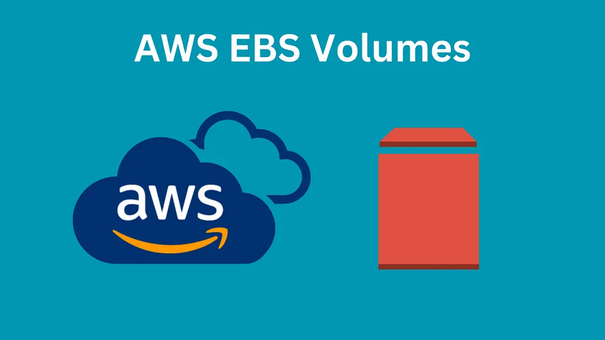

  

<h1 align="center" style="color:#2E86C1;">AWS EBS – Volume Creation & Attachment Guide</h1>
 

<h3 align="left" style="color:#2E86C1;">📝 Introduction</h3>

---

This guide explains how to **create an EBS Volume** and **attach it to an EC2 instance** on AWS.  
EBS volumes provide scalable storage for your virtual servers (EC2).

---

<h3 align="left" style="color:#2E86C1;">⚙️ Prerequisites</h3>

---

Before you begin:

- **Launch a Linux or Windows EC2 Instance**  
   - In this case, the demo is performed on a **Windows Server**, but the steps are similar for Linux.
   - For server creation guides, refer to:

   - 👉 [Linux EC2 Server Setup Guide](https://github.com/AbhilashMaurya/aws-internship/tree/main/Server-Creation/aws-linux(EC2))  
   - 👉 [Windows EC2 Server Setup Guide](https://github.com/AbhilashMaurya/aws-internship/tree/main/Server-Creation/aws-windows)

---

<h3 align="left" style="color:#2E86C1;">🧭 Steps to Create and Attach EBS Volume</h3>

---

### 📌 Step 1: Open AWS Console

- Search for **EBS** in the AWS Dashboard  
- Click on **Elastic Block Store → Volumes**
 

---

### 📌 Step 2: Create a New Volume

- Click on **Create Volume**

#### Select **Volume Type**

| Type | Description |
|------|-------------|
| **gp3 / gp2 (General Purpose SSD)** | Balanced price/performance for most workloads |
| **io1 / io2 (Provisioned IOPS SSD)** | High-performance SSD with customizable IOPS, used for databases |
| **st1 (Throughput Optimized HDD)** | Low-cost HDD, best for big data, logs, streaming workloads |
| **sc1 (Cold HDD)** | Lowest cost, for infrequent access (cold storage) |
| **Standard (Magnetic)** | Older generation, rarely used now |

---

### 📌 Step 3: Configure the Volume

- **Enter Size (in GB)**  
- **Specify IOPS** (only for io1/io2 volumes)  
- **Select Availability Zone**  
   - **Important:** Must match the **AZ of your EC2 instance**.  
   - Example: If your instance is in **`ap-south-1a`**, select the same.

---

### 📌 Step 4: Create Volume

- Click **Create Volume**
- The new volume will appear in the **Volumes list**

---

### 📌 Step 5: Attach the Volume

- Select the volume you just created  
- Click on **Actions → Attach Volume**  
- Choose the **Instance ID** of your server  
- Define the **Device Name** (e.g., `/dev/xvdf` for Linux)

<h3 align="left" style="color:#2E86C1;">📽️ Full Video Demonstration</h3>

---

> Watch the **complete hands-on video** for volume creation and attachment:

  <a href="https://drive.google.com/file/d/1iOSXTbt6Stkswz2Fn2LuIjRUu_FKIU6F/view?usp=sharing">
    
    video click to watch
  </a>

---

<h3 align="left" style="color:#2E86C1;">🗑️ Cleanup (Optional)</h3>

---

- **Detach Volume** if you no longer need it:  
   `Actions → Detach Volume`
- **Delete the Volume** to avoid storage costs.

---

<h3 align="left" style="color:#2E86C1;">📚 Learnings</h3>

---

- How to create EBS volumes  
- Types of EBS volumes and their use cases  
- How to attach storage to EC2 servers  
- Best practices for availability zone matching  

---

## 🔗 Resources

- [AWS EBS Documentation](https://docs.aws.amazon.com/AWSEC2/latest/UserGuide/AmazonEBS.html)
- [AWS Free Tier](https://aws.amazon.com/free)

