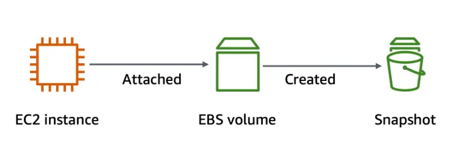
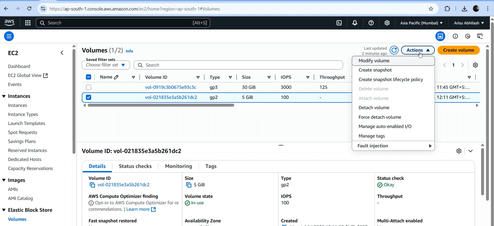
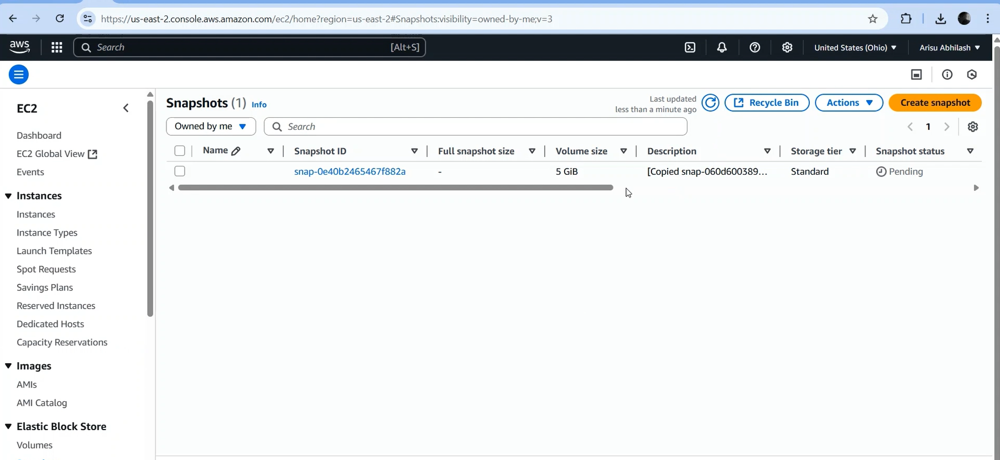
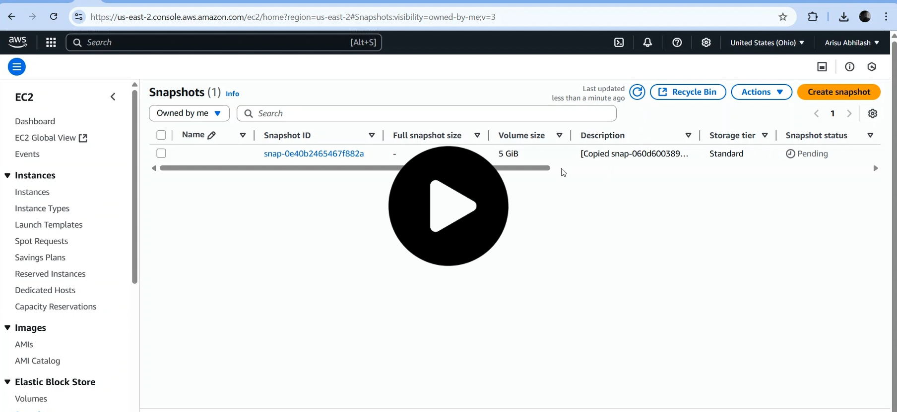

  

<h1 align="center" style="color:#2E86C1;">AWS EBS – Volume Snapshot, Cross-Region Copy & Data Verification</h1>
 

<h3 align="left" style="color:#2E86C1;">📝 Introduction</h3>

---

This guide helps you:

- **Backup your EBS volume** using snapshots  
- **Copy the snapshot to another region**  
- **Restore the data to a new EC2 server**  
- **Verify that your stored data is safe**

---

<h3 align="left" style="color:#2E86C1;">⚙️ Prerequisites</h3>

---

Before creating a snapshot, make sure you have:

✅ **An EC2 instance running (Linux/Windows)**  

✅ **An additional EBS volume attached to the instance** 
 

👉 [volume creation and attaching Guide](https://github.com/ArisuAbhilash/aws-internship/blob/main/3.EBS(elastic-block-strorage)/1.volume-creation-attaching/volume-creation-attaching.md) 
 

✅ **Some data stored in the attached EBS volume**  

---

### 🗂️ **Why store data before snapshot?**

Snapshots are **block-level backups** of EBS volumes.  
To check if your backup works:

- **Create or copy a file** into the **newly attached EBS volume** (e.g., `backup-test.txt`)  
- **Then create the snapshot** so you can verify the data is there after restoration.

---

<h3 align="left" style="color:#2E86C1;">🧭 Step-by-Step Guide</h3>

---

### 📌 Step 1: Create Snapshot of the EBS Volume

- Go to **Elastic Block Store → Volumes**  
- Select your **data volume**  
- Click on **Actions → Create Snapshot**

#### Configure Snapshot:

- Provide a **name & description** (e.g., `Data-Backup-Snapshot`)  
- Click **Create Snapshot**

  

---

### 📌 Step 2: Copy Snapshot to Another Region

- Go to **Snapshots**  
- Select your **created snapshot**  
- Click **Actions → Copy Snapshot**

#### In the copy settings:

- **Destination Region:** Select where you want to copy (e.g., `us-east-1`, `ap-south-1`)  
- **Name the copied snapshot**  
- Click **Copy**

  

---

### 📌 Step 3: Launch a Volume from Snapshot in New Region

- Switch AWS Console to the **destination region**  
- Go to **Snapshots → Select your copied snapshot**  
- Click **Actions → Create Volume**

#### Configure Volume:

- Select the **Availability Zone** of your new server  
- Keep the volume type as required  
- Click **Create Volume**

---

### 📌 Step 4: Attach Volume to New Server

- Go to **Volumes**  
- Select the new volume  
- Click **Actions → Attach Volume**  
- Select your **new EC2 instance** in the new region  
- Define a **device name** (e.g., `/dev/xvdf` for Linux)

---

### 📌 Step 5: Verify the Data

- **Login to your new server**  
- **Mount the volume** (in Linux) or assign a drive letter (in Windows)  
- Check for the file or data you stored earlier (e.g., `backup-test.txt`)  
- ✅ If the file is there, the backup & restore is successful!

---

<h3 align="left" style="color:#2E86C1;">📽️ Full Video Demonstration</h3>

---

> Watch the **complete hands-on video** for snapshot creation, copying to another region, attaching to a new server, and verifying the data.

  <a href="https://drive.google.com/file/d/1Wem1vuoGanSb6Ss5Ll3mbpOUOgJXXvpi/view?usp=drive_link">
    
   
  Video Click To Play
  </a>

---

<h3 align="left" style="color:#2E86C1;">🗑️ Cleanup (Optional)</h3>

---

- **Detach the volume** if no longer needed  
- **Delete the snapshot** from both regions  
- **Delete the volume** if you want to stop storage costs

---

<h3 align="left" style="color:#2E86C1;">📚 Learnings</h3>

---

- How to create an EBS snapshot  
- How to copy snapshots across regions  
- How to restore data from snapshots  
- How to verify backups by checking actual data  
- Real-world **disaster recovery simulation**

---

## 🔗 Resources

- [AWS EBS Snapshots Documentation](https://docs.aws.amazon.com/AWSEC2/latest/UserGuide/ebs-creating-snapshot.html)  
- [AWS Free Tier](https://aws.amazon.com/free)

