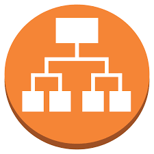
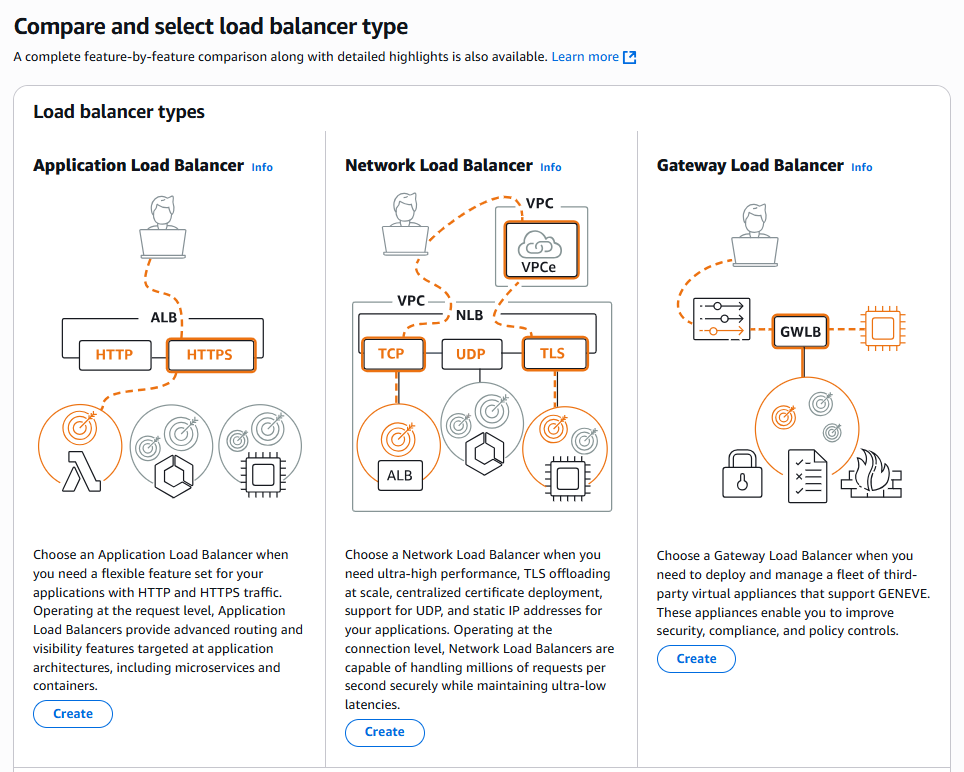
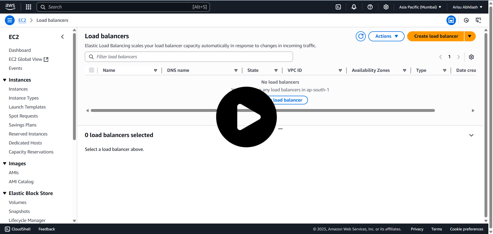

  

<h1 align="center" style="color:#2E86C1;">AWS EC2 – Load Balancer Setup with AMI Replicated Servers</h1>
 

<h3 align="left" style="color:#2E86C1;">📝 Introduction</h3>

---

This guide helps you set up an **Application Load Balancer (ALB)** in AWS to distribute traffic across multiple servers.

We’ll simulate **real server responses** and explain how to create **identical servers using AMI** before setting up the Load Balancer.

---

<h3 align="left" style="color:#2E86C1;">⚙️ Before You Start</h3>

---

### ✅ **Two Ways to Prepare Multiple Servers:**

#### **Option 1: Create Servers Individually**

- Launch **2 or more EC2 instances** (Linux or Windows)  
- Install a web server (e.g., Apache, NGINX)  
- Add **custom data** to each server (like `This is Server 1`, `This is Server 2`, etc.)

---

#### **Option 2: Use AMI to Create Multiple Servers (Recommended)**

If you already have a **server with required setup (web server, data)**:

1. **Create an AMI (Amazon Machine Image)** from that server  
2. **Launch multiple EC2 instances from the AMI**  

This saves time and ensures **all servers are identical.**

---

#### **AMI Reference:**

👉 Use the [AMI Creation Guide](https://github.com/ArisuAbhilash/aws-internship/tree/main/2.AMI(amazon-machine-image))  
Follow the steps to create and launch multiple servers from your custom AMI.

---

### ✅ **Example Setup (What I did):**

| **Server** | **Response Data** |
|------------|-------------------|
| **Server 1** | `This is Server 1` |
| **Server 2** | `This is Server 2` |
| **Server 3** | `This is Server 3` |

All servers are **running Apache on port 80** and **responding with different content**.

---

<h3 align="left" style="color:#2E86C1;">🧭 Load Balancer Setup Steps</h3>

---

### 📌 Step 1: Open Load Balancer in AWS Console

- Go to the **EC2 Dashboard**  
- Scroll to **Load Balancing → Load Balancers**  
- Click on **Create Load Balancer**

---

### 📌 Step 2: Select Load Balancer Type

Choose **Application Load Balancer (ALB)**  

**Other options:**

- Network Load Balancer – For TCP/UDP  
- Gateway Load Balancer – For appliance traffic  

---

### 📌 Step 3: Create Application Load Balancer

#### **Basic Configuration:**

- **Name:** `my-load-balancer`  
- **Scheme:** Internet-facing (for public access)  
- **IP Address Type:** IPv4  
 

  

---

### 📌 Step 4: Configure Availability Zones

- Select your **VPC**  
- Choose **at least two Availability Zones**  
- Select the **subnets** linked to your servers  

---

### 📌 Step 5: Configure Security Group

- Allow **port 80 (HTTP)** inbound in the Load Balancer security group.

---

### 📌 Step 6: Create Target Group (Open in New Tab)

- Go to **Target Groups**  
- Click **Create Target Group**

#### **Target Group Settings:**

- **Type:** Instances  
- **Name:** `tg1`  
- **Protocol:** HTTP  
- **Port:** 80  

Click **Next → Register Targets**
- Select your **3 servers (created manually or via AMI)**  
- Click **Add to Registered**  
- Click **Create Target Group**

---

### 📌 Step 7: Back to Load Balancer Tab

- In Load Balancer creation, select the **Target Group (`tg1`)** you just created  
- Click **Create Load Balancer**

-----
### 📌 Step 8: Test the Load Balancer</h3>

- Go to **Load Balancer → Description**  
- Copy the **DNS link**  
- Paste it in your browser  

### ✅ **What You’ll See:**

On refreshing the page, you’ll see different server responses:

h3 align="left" style="color:#2E86C1;">📽️ Full Video Demonstration</h3>

---

> Watch the **complete step-by-step video** showing AMI creation, server replication, Load Balancer setup, and testing.

  <a href="https://drive.google.com/file/d/1UVgwi8q4TQHyOMtu3y3c2m_rZiJiR8-o/view?usp=drive_link">
    
   Click to watch video  
  </a>

