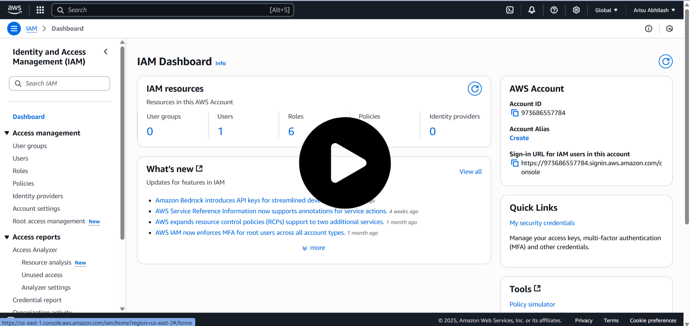

  

<h1 align="center" style="color:#2E86C1;">AWS IAM – User & Policy Management Guide</h1>
 

<h3 align="left" style="color:#2E86C1;">📝 Introduction</h3>

---

**AWS IAM (Identity and Access Management)** allows you to **create users and manage access control** in your AWS account.

This guide explains how to:

- Create IAM Users  
- Manage EC2 and SNS permissions  
- Test IAM user restrictions

---

<h3 align="left" style="color:#2E86C1;">🧭 Step-by-Step Instructions</h3>

---

### 📌 **Step 1: Open IAM in AWS Console**

- Go to **AWS Console**  
- Search for **IAM** and open it

---

### 📌 **Step 2: Create IAM User**

- Click on **Users → Add User**  
- **User Name:** Example: `user_001`  
- **Access Type:**  
  - ✅ AWS Management Console Access  
- **Password:**  
  - Set a **custom password** or use **autogenerated**  
  - (Optional) Enable **"User must change password at next sign-in"**

---

### 📌 **Step 3: Attach Permissions (EC2 Test)**

- Choose **Attach policies directly**  
- Select **`AmazonEC2ReadOnlyAccess`** (for testing)

---

### 📌 **Step 4: Login as IAM User**

- Copy the **IAM User Sign-in URL**  
- Open it in **incognito mode** or on **another device**  
- Login with the **IAM user credentials**

---

### 📌 **Step 5: Test EC2 Access**

- In the **root account**, create a new **EC2 instance**  
- In the **IAM user account (`user_001`)**, check EC2 dashboard:

    ✅ **You can view the instance**

    ❌ **You cannot terminate or create instances** (read-only)

---

### 📌 **Step 6: Update Permissions to Full Access**

- Go back to **Root Account → IAM → Users → user_001**  
- Click **Add Permissions → Attach Policies**  
- Attach **`AmazonEC2FullAccess`**  
- Save changes

---

### 📌 **Step 7: Test Again in IAM User**

- Now you can **terminate** and **launch** instances from **IAM user_001**

---

<h3 align="left" style="color:#2E86C1;">📦 SNS Permissions Test</h3>

---

### 📌 **Step 8: Create a Custom SNS Policy**

- Go to **IAM → Policies → Create Policy**  
- **Service:** SNS  
- **Actions:**  
  - `ListTopics`  
  - `Publish`  
- **Resources:** All or specific topic (as per your use case)

- **Policy Name:** `SNS-List-Publish-Only`  
- Click **Create Policy**

---

### 📌 **Step 9: Attach SNS Policy to IAM User**

- Go to **IAM → Users → user_001**  
- Attach the **`SNS-List-Publish-Only`** policy  
- Login as IAM user  
- ✅ **Can list topics and publish messages**  
- ❌ **Cannot delete topics**

---

### 📌 **Step 10: Create Full Access SNS Policy**

- Again go to **IAM → Policies → Create Policy**  
- **Service:** SNS  
- **Actions:** **All SNS actions**  
- **Resources:** All  
- **Policy Name:** `SNS-Full-Access`  
- Click **Create Policy**

---

### 📌 **Step 11: Attach SNS Full Access**

- Attach **`SNS-Full-Access`** to **user_001**  
- Now the user can **list, publish, create, and delete SNS topics**

---

<h3 align="left" style="color:#2E86C1;">⚠️ Important Notes</h3>

---

- **Region Selection:**  
  SNS topics are **region-specific**, ensure you are in the **correct region** while testing.

- **Least Privilege Principle:**  
  Always give **minimum required permissions** first, then add more if needed.

---

<h3 align="left" style="color:#2E86C1;">📽️ Video Demonstration</h3>

---

> Watch the **IAM user and policy management video** for complete hands-on.

  <a href="https://drive.google.com/file/d/1YKk2LTr9b611OUc1A6NVio4m4te5AGmP/view?usp=sharing">
    
      Click To Watch Video
  </a>

---

<h3 align="left" style="color:#2E86C1;">📚 Learnings</h3>

---

- How to **create IAM users**  
- How to assign **read-only and full access permissions**  
- How to **create custom policies**  
- How to test permissions using **EC2 and SNS services**

---

## 🔗 Resources

- [AWS IAM Documentation](https://docs.aws.amazon.com/IAM/latest/UserGuide/introduction.html)  
- [AWS Free Tier](https://aws.amazon.com/free)

